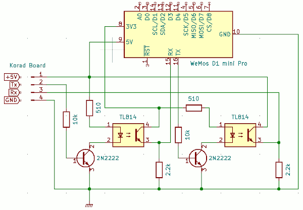
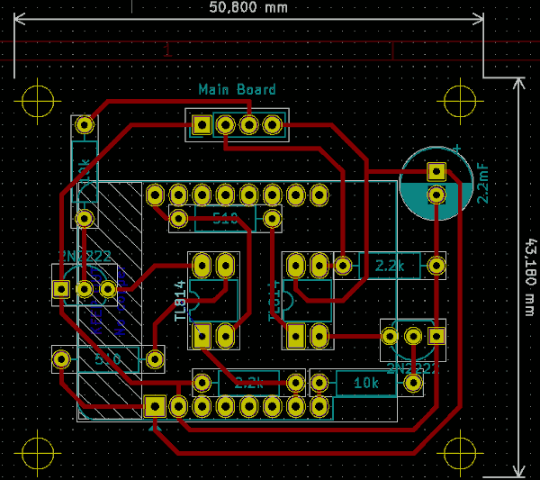
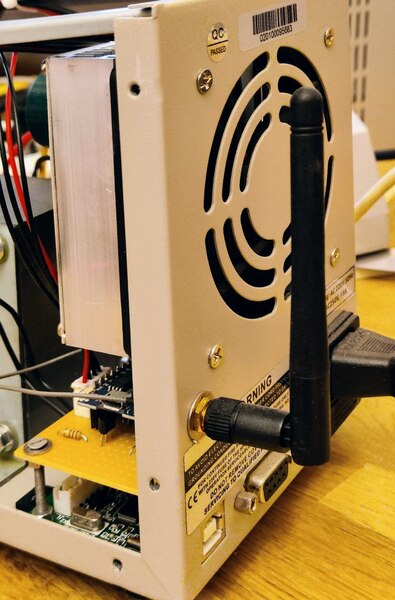
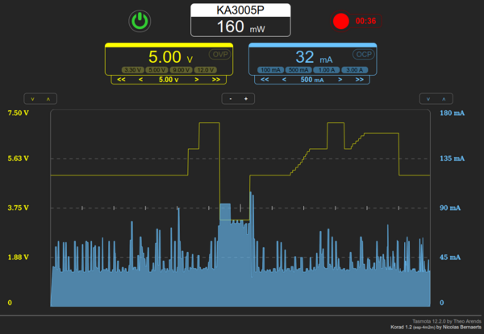

# KORAD power supply Tasmota firmware

This evolution of **Tasmota 12** has been specifically developped to manage **Korad KA3005P** laboratory power supply.

Korad serial protocol is well documented at https://sigrok.org/wiki/Korad_KAxxxxP_series

To use it, your need to add one specific ESP8266 extension card connected to the internal serial port of the power supply.

A complete explanation with step by step procedure is available at http://www.bernaerts-nicolas.fr/iot/365-tasmota-korad-power-supply-web-mqtt

Pre-compiled versions are available in the [**binary**](https://github.com/NicolasBernaerts/tasmota/tree/master/korad/binary) folder.

## Adapter board

To communication with your **Korad KA3005P** power supply, you need to connect an internal Tasmota adapter board.

This board replaces the serial <-> USB internal board.

Tasmota will then handle all serial protocol allowing you to manage the power supply thru a simple Web browser.

Here is the adapter board diagram and board design based on a **Wemos mini D1 Pro**.

Once placed in the power supply unit you should get something like this :

You can see the original **serial <-> USB** board under the new **Wemos Mini** daughter board.

Connector used is the original one, just unplugged from original daughter board.

## Configuration

Input devices should be configured as followed :
  - Serial Rx : connected to Korad Tx
  - Serial Tx : connected to Korad Rx

As LittleFS is enabled, settings are stored in /korad.cfg

## Compilation

If you want to compile this firmware version, you just need to :
1. install official tasmota sources
2. place or replace files from this repository
3. place specific files from **tasmota/common** repository

Here is where you should place different files from this repository and from **tasmota/common** :
* **platformio_override.ini**
* tasmota/**user_config_override.h**
* tasmota/tasmota_drv_driver/**xdrv_01_9_webserver.ino**
* tasmota/tasmota_drv_driver/**xdrv_50_filesystem_cfg_csv.ino**
* tasmota/tasmota_drv_driver/**xdrv_94_ip_address.ino**
* tasmota/tasmota_drv_driver/**xdrv_96_korad.ino**
* tasmota/tasmota_sns_sensor/**xsns_120_timezone.ino**

If everything goes fine, you should be able to compile your own build.

## Screen shots

Once you've flashed the specific Tasmota firmware, you should get the following control panel accessible thru Tasmota.

### Configuration

   

### Control

