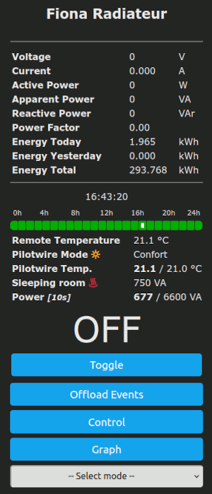
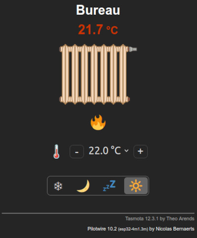
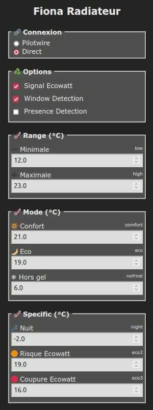

# Offload & Pilotwire Tasmota firmware #

These 2 firmwares are based on Tasmota **v12**. They have been developped to provide :
* **Offload** capacity based on a MQTT subscription to a global Meter
* **Pilotwire** management for electrical heaters using **Fil Pilote** protocol widely available in France

This firmare provides :
  * Web configuration interface
  * extension of JSON MQTT status
  * new specific MQTT commands
  * automatic offload when global power is overloading your contract
  * night mode management (timer ON = go to night mode, timer OFF = go back to normal mode)
  * **/control** public page to control the device
  * **/histo** public page to get offloading history

## Offload

**Offload** firmware provides an offload capability based on :
  * the device power
  * your actual global consumption
  * your contact maximum power

If global power exceed your contract level, device is offloaded as long as your global consumption has not dropped enougth. \
It allows to cut devices like geaser, ... before your house meter strips because of over-power.

It has been tested on **Sonoff S26**, **Sonoff Pow R2**, **Athom power plug** and various **ESP32** boards.

### Configuration ###

You need to configure usual tasmota stuff, plus the **Offload** section.

Here, you need to configure :
  * The topic where your energy meter data are published
  * The key where to read your contract maximum power (VA)
  * The key xhere to read your global instant power (VA)
  * The power of device controled by your Tasmota
  * Priority of the device in case off offloading (several devices may offload the one after the other)
  
After next restart, offload mecanism will start.

### Console commands

Here the console commands provided with this firmware :
  * **ol_help** : list of available commands
  * **ol_power** [value] : device power (VA)
  * **ol_type** [value] : device type (see **ol_help** for the full list)
  * **ol_prio** [value] : device priority (1 max ... 10 min)
  * **ol_max** [value] : contract power (VA)
  * **ol_adj** [value] : contract power adjustment (in %, 100% = contract)
  * **ol_topic** [topic] : MQTT topic of the meter
  * **ol_kmax** [key] : MQTT key for contract power
  * **ol_kinst** [key] : MQTT key for current meter instant power
  * **ol_rearm** [value] : Switch rearm delay (0 no rearm or rearm delay in sec.)

### MQTT

Offload MQTT JSON result should look like that :

    23:59:26.476 MQT: chambre2nd/tele/STATE = {"Time":"2022-01-19T23:59:26","Offload":{"State":0,"Stage":0,"Device":1500},"TempUnit":"C"}}

## Pilotwire

Pilotwire firmware allows to handle an electrical heater using the **fil pilote** french protocol.

It is an extension of previous **Offload** firmware, so that it provides the same offload capabilities described before.

This firmware specifically manages :
  * **thermostat** according to any declared temperature sensor (local or remote)
  * **presence detection** to lower thermostat in case of vacancy
  * **opened window detection** to cut power when window is opened
  * **night mode** to lower temperature at night
  * **ecowatt** signal action to lower thermostat in case of risk of power cut
  * **offload** management

**Pilotwire** has been tested on **Sonoff Basic** (1Mb), **ESP01** (1Mb), **Wemos D1 Mini** (4Mb) and **ESP32** (4Mb).

Pilotwire protocol is described at http://www.radiateur-electrique.org/fil-pilote-radiateur.php
 
### Hardware setup

You need to connect a diode between your relay output and the heater's *fil pilote* (usually black color wire).

Typical diode to use is **1N4007**. Connexion should be done directly on the relay output :

### Configuration

First you need to configure normal Tasmota stuff and **Offload** section.

Then, if you are using remote MQTT sensors (temperature and/or presence), you may need to configure **Sensor** section.

Then you need to configure **Pilotwire** section. It allows :
  * to select pilotwire protocol or direct plug management
  * to select pilotwire options (open window detection, movement detection and Ecowatt signal)
  * to configure target temperature for different cases

Finally you may configure the **Ecowatt** topic you want to subscribe to. This is done in console mode :

     # eco_topic ecowatt/tele/SENSOR

You can adjust topic to your environment.

It then allows to adjust target temperature according to Ecowatt signals level 2 (low risk of power cut) and level 3 (high risk of power cut).

#### Night mode

Night mode allows to automatically drop temperature at night.

It is configured thru standard Tasmota **timers** :
  * Timer **ON** switch to **comfort** temperature
  * Timer **OFF** switches to **night mode** temperature

#### Open Window detection

Open window detection allows to automatically cut the heater when a window is opened and to sxwitch it back on when window is closed.

Its principle is quite simple : 
  * if temperature drops 0.5°C in less than 4mn heater is switched off
  * it is switched back on when temperature increase 0.2°C

Any change in running mode resets the open window detection.

#### Presence detection

Presence detection works as follow :

  * Main rules
    * if no movement sensor is present, movement is considered as permanent
    * you can configure an **initial** timeout period in minutes
    * you can configure a **no movement** timeout period in minutes

  * When **Confort Mode** is set :
    * when you set comfort mode, target temperature is set to comfort mode
    * if there is no movement after **initial** timeout, target temperature is set to **eco** mode 
    * as soon as there is a movement detected, target temperature is set to comfort mode
    * if there is no movement after **no movement** timeout, target temperature is set to **eco** mode

  * When **Confort Temperature** is changed :
    * when you change comfort mode target temperature, target temperature is set back to comfort mode
    * if there is no movement after **no movement** timeout, target temperature is set to **eco** mode

### Console commands

Here the console commands provided with this firmware :
  * **pw_help** : list of available commands
  * **pw_type** [value] : device type (0 - Pilotwire, 1 - Direct connexion)
  * **pw_mode** [value] : heater running mode (0 - Off, 1 - Economie, 2 - Nuit, 3 - Confort, 4 - Forcé)
  * **pw_target** [value] : target temperature (°C)
  * **pw_ecowatt** [0/1] : disable/enable ecowatt management
  * **pw_window** [0/1] : disable/enable open window detection
  * **pw_presence** [0/1] : disable/enable presence detection
  * **pw_low** [value] : lowest acceptable temperature (°C)
  * **pw_high** [value] : highest acceptable temperature (°C)
  * **pw_comfort** [value] : default comfort temperature (°C)
  * **pw_nofrost** [value] : no frost temperature (delta with comfort if negative)
  * **pw_eco** [value] : eco temperature (delta with comfort if negative)
  * **pw_night** [value] : night temperature (delta with comfort if negative)
  * **pw_eco2** [value] : ecowatt level 2 temperature (delta with comfort if negative)
  * **pw_eco3** [value] : ecowatt level 3 temperature (delta with comfort if negative)
  * **pw_initial** [value] : presence detection timeout when changing running mode (mn)
  * **pw_normal** [value] : presence detection timeout after detection (mn)

### MQTT

Pilotwire MQTT JSON result should look like that :

    23:59:26.476 MQT: chambre2nd/tele/STATE = {"Time":"2022-01-19T23:59:26","Pilotwire":{"Mode":2,"Status":2,"Heating":1,"Temperature":16.9,"Target":17.0,"Detect":128,"Window":0},"Offload":{"State":0,"Stage":0,"Device":1500},"TempUnit":"C"}}

### Compilation

Pre-compiled version of Tasmota handling **offload** and **fil pilote** are available in the **bin** directory.

If you want to compile this firmware version, you just need to :
1. install official tasmota sources
2. place or replace files from this repository
3. place specific files from **tasmota/common** repository

Here is where you should place different files from this repository and from **tasmota/common** :
* **platformio_override.ini**
* lib/default/**ArduinoJson**
* tasmota/**user_config_override.h**
* tasmota/include/**tasmota.h**
* tasmota/tasmota_drv_driver/**xdrv_01_9_webserver.ino**
* tasmota/tasmota_drv_driver/**xdrv_50_filesystem_cfg_csv.ino**
* tasmota/tasmota_drv_driver/**xdrv_93_filesystem_log.ino**
* tasmota/tasmota_drv_driver/**xdrv_94_ip_address.ino**
* tasmota/tasmota_drv_driver/**xdrv_96_offload.ino**
* tasmota/tasmota_drv_driver/**xdrv_97_ecowatt_client.ino**
* tasmota/tasmota_sns_sensor/**xsns_120_timezone.ino**
* tasmota/tasmota_sns_sensor/**xsns_124_hlk_ld.ino**
* tasmota/tasmota_sns_sensor/**xsns_125_generic_sensor.ino**
* tasmota/tasmota_sns_sensor/**xsns_126_pilotwire.ino**

If everything goes fine, you should be able to compile your own build.

### Screen shot

#### Main

 

#### Control and Graph

### Config

 
 

