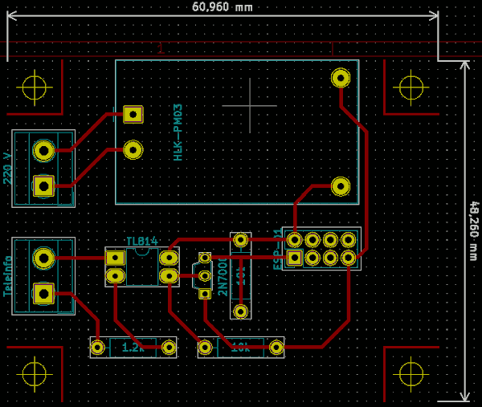
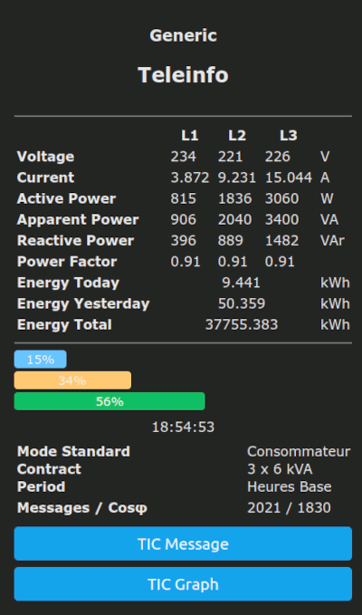
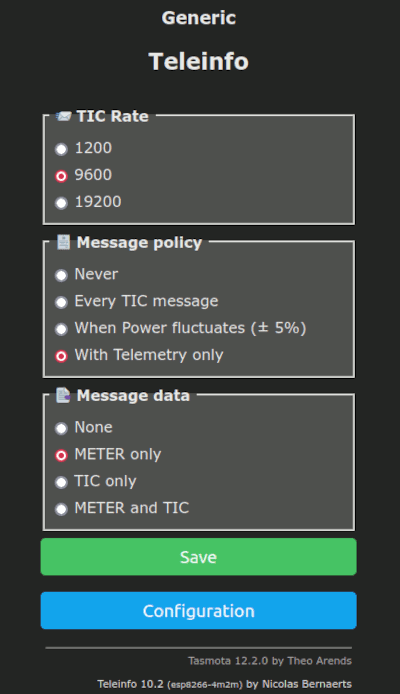
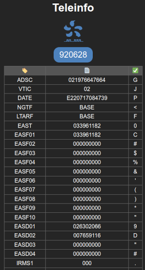
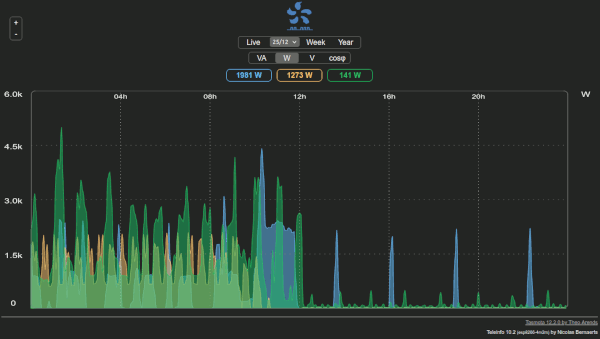
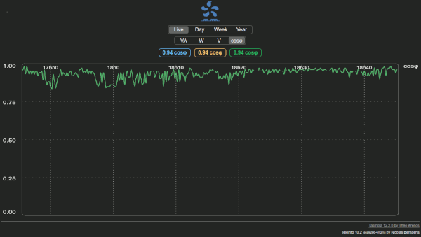
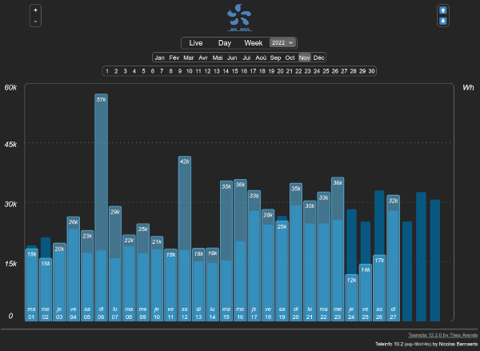
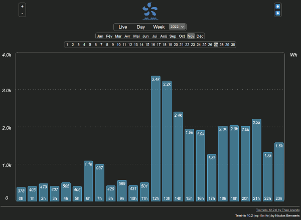

# Teleinfo Tasmota firmware for Linky meters

## Presentation

This evolution of **Tasmota 12.4.0** firmware has been enhanced to handle France energy meters known as **Linky** using **Teleinfo** protocol.

This firmware has been developped and tested on  :
  * **Sagem Classic Monophase** with TIC **Historique**
  * **Linky Monophase** with TIC **Historique** & **Standard**
  * **Linky Triphase** with TIC **Historique** & **Standard**
  * **Ace6000 Triphase** with TIC **PME/PMI**

It has been compiled and tested on the following devices :
  * **ESP8266** 1Mb
  * **ESP12F** 4Mb and 16Mb
  * **ESP32** 4Mb
  * **ESP32S2** 4Mb
  * **ESP32S3** 16Mb
 
Please note that it is a completly different implementation than the one published early 2020 by Charles Hallard and actually on the official Tasmota repository. 

Some of these firmware versions are using a LittleFS partition to store graph data. Il allows to keep historical data over reboots.
To take advantage of this feature, make sure to follow partitioning procedure given in the **readme** of the **binary** folder.

It manages :
  * Voltage (**V**)
  * Current (**A**)
  * Instant Power (**VA** and **W**)
  * Active Power total (**Wh**)
  * Power Factor (**Cosφ**), calculated from Instant Power (VA) and meter Total (Wh)

This firmware provides some extra Web page on the device :
  * **/graph** : live, daily and weekly graphs (VA, W, V and Cos phi)
  * **/msg** : real time display of last received Teleinfo message

It also provides :
  * a TCP server to stream teleinfo
  * a FTP server to easily retrieve logs

If you are using a LittleFS version, you'll also get peak apparent power and peak voltage on the graphs.

If your linky in in historic mode, it doesn't provide instant voltage. Voltage is then forced to 230V.

If you are using an **ESP32** board, you can use the wired connexion by selection the proper board model in **Configuration/ESP32 board**.

Pre-compiled versions are available in the [**binary**](./binary) folder.

Teleinfo protocol is described in [this document](https://www.enedis.fr/sites/default/files/Enedis-NOI-CPT_54E.pdf)

## MQTT data

In the configuration page, you can ecide to publish Teleinfo data in a specific MQTT **TIC** section.

You'll then retrieve all teleinfo keys :
  * **ADCO**, **ADCS** = contract number
  * **ISOUSC** = max contract current per phase 
  * **SSOUSC** = max contract power per phase
  * **IINST**, **IINST1**, **IINST2**, **IINST3** = instant current per phase
  * **ADIR1**, **ADIR2**, **ADIR3** = overload message
  * ...

You can also retrieve all energy meter values under MQTT **METER** :
  * **PH** = number of phases
  * **PSUB** = power per phase in the contract (VA) 
  * **ISUB** = current per phase in the contract 
  * **PMAX** = maximum power per phase including an accetable % of overload (VA)  
  * **Ix** = instant current on phase **x** 
  * **Ux** = instant voltage on phase **x** 
  * **Px** = instant apparent power on phase **x** 
  * **Wx** = instant active power on phase **x** 
  * **Cx** = instant power factor on phase **x** 

MQTT result should look like that :

    compteur/tele/STATE = {"Time":"2021-03-13T09:20:26","Uptime":"0T13:20:12","UptimeSec":48012,"Heap":17,"SleepMode":"Dynamic","Sleep":50,"LoadAvg":19,"MqttCount":1,"Wifi":{"AP":1,"SSId":"hello-nantes","BSSId":"30:23:03:xx:xx:xx","Channel":5,"RSSI":64,"Signal":-68,"LinkCount":1,"Downtime":"0T00:00:05"}}
    compteur/tele/SENSOR = {"Time":"2021-03-13T09:20:26","ENERGY":{"TotalStartTime":"2021-03-13T09:20:26","Total":7970.903,"Yesterday":3.198,"Today":6.024,"Period":63,"Power":860,"Current":4.000},"TIC":{"ADCO":"061964xxxxxx","OPTARIF":"BASE","ISOUSC":"30","BASE":"007970903","PTEC":"TH..","IINST":"004","IMAX":"090","PAPP":"00860","HHPHC":"A","MOTDETAT":"000000","PHASE":1,"SSOUSC":"6000","IINST1":"4","SINSTS1":"860"},"IP":"192.168.xx.xx","MAC":"50:02:91:xx:xx:xx"}
    compteur/tele/SENSOR = {"Time":"2021-03-13T09:20:30","TIC":{"ADCO":"061964xxxxxx","OPTARIF":"BASE","ISOUSC":"30","BASE":"007970903","PTEC":"TH..","IINST":"003","IMAX":"090","PAPP":"00780","HHPHC":"A","MOTDETAT":"000000","PHASE":1,"SSOUSC":"6000","IINST1":"3","SINSTS1":"780"}}
    compteur/tele/SENSOR = {"Time":"2021-03-13T09:25:11","TIC":{"ADCO":"061964xxxxxx","OPTARIF":"BASE","ISOUSC":"30","BASE":"007970947","PTEC":"TH..","IINST":"004","IMAX":"090","PAPP":"00860","HHPHC":"A","MOTDETAT":"000000","PHASE":1,"SSOUSC":"6000","IINST1":"4","SINSTS1":"860"}}
    compteur/tele/STATE = {"Time":"2021-03-13T09:25:26","Uptime":"0T13:25:12","UptimeSec":48312,"Heap":18,"SleepMode":"Dynamic","Sleep":50,"LoadAvg":19,"MqttCount":1,"Wifi":{"AP":1,"SSId":"hello-nantes","BSSId":"30:23:03:xx:xx:xx","Channel":5,"RSSI":64,"Signal":-68,"LinkCount":1,"Downtime":"0T00:00:05"}}
    compteur/tele/SENSOR = {"Time":"2021-03-13T09:25:26","ENERGY":{"TotalStartTime":"2021-03-13T09:25:26","Total":7970.950,"Yesterday":3.198,"Today":6.071,"Period":47,"Power":860,"Current":4.000},"TIC":{"ADCO":"061964xxxxxx","OPTARIF":"BASE","ISOUSC":"30","BASE":"007970950","PTEC":"TH..","IINST":"004","IMAX":"090","PAPP":"00860","HHPHC":"A","MOTDETAT":"000000","PHASE":1,"SSOUSC":"6000","IINST1":"4","SINSTS1":"860"},"IP":"192.168.xx.xx","MAC":"50:02:91:xx:xx:xx"}

## Log files

If you run this firmware on an ESP having a LittleFS partition, it will generate 3 types of energy logs :
  * **teleinfo-day-nn.csv** : average values daily file with a record every ~5 mn. **00** is today's log, **01** yesterday's log, ...
  * **teleinfo-week-nn.csv** : average values weekly file with a record every ~30 mn. **00** is current week's log, **01** is previous week's log, ...
  * **teleinfo-year-yyyy.csv** : kWh total yearly file with a line per day and detail of hourly total for each day.

Every CSV file includes a header.

These files are used to generate all graphs other than **Live** ones.

## Commands

This Teleinfo firmware can be configured thru some  specific console commands :

  * **tic_help** : list all available commands
  * **tic_enable** [0/1] : disable / enable teleinfo messages reception
  * **tic_rate** [rate] : set serial rate (1200, 9600 or 19200)

  * **tic_percent** [value] : maximum acceptable power according to contrat (in %). Used to calculate **PMAX**
  * **tic_msgpol** [value] : message publish policy (0 - Never, 1 - Every TIC message, 2 - When Power fluctuates (± 5%), 3 - With Telemetry only)
  * **tic_msgtype** [value] : message type publish policy (0 - None, 1 - METER only, 2 - TIC only, 3 - METER and TIC)

  * **tic_buffer** [0/1] : log policy (0:immediate, 1:buffered)
  * **tic_nbday** [value] : number of daily logs
  * **tic_nbweek** [value] : number of weekly logs

  * **tic_maxv** [value] : maximum voltage (v) in graph display
  * **tic_maxva** [value] : maximum power (va and w) in graph display
  * **tic_maxhour** [value] : maximum total per hour (wh) in graph display
  * **tic_maxday** [value] : maximum total per day (wh) in graph display
  * **tic_maxmonth** [value] : maximum total per month (wh) in graph display

## TCP server

This firmware brings a minimal embedded TCP server.

This server allows you to retrieve the complete teleinfo stream over your LAN.

Here are the commands available for this TCP server :

  * **tcp_help** : list of available commands
  * **tcp_status** : status of TCP server (running port or 0 if not running)
  * **tcp_start** [port] : start TCP server on specified port
  * **tcp_stop** : stop TCP server

When started, you can now receive your Linky teleinfo stream in real time on any Linux pc :

    # nc 192.168.1.10 8888
        SMAXSN-1	E220422144756	05210	W
        CCASN	E220423110000	01468	:
        CCASN-1	E220423100000	01444	Q
        UMOY1	E220423114000	235	(
        STGE	003A0001	:
        MSG1	PAS DE          MESSAGE         	<

Server allows only 1 concurrent connexion. Any new client will kill previous one.

## FTP server

If you are using a build with a LittleFS partition, you can access the partition thru a very basic FTP server embedded in this firmware.

This can allow you to retrieve automatically any CSV generated file.

Here are the commands available for this TCP server :
  * **ftp_help** : list of available commands
  * **ftp_status** : status of FTP server (running port or 0 if not running)
  * **ftp_start** : start FTP server on port 21
  * **ftp_stop** : stop FTP server

On the client side, credentials are :
  * login : **teleinfo**
  * password : **teleinfo**

This embedded FTP server main limitation is that it can only one connexion at a time. \
So you need to limit simultaneous connexions to **1** on your FTP client. Otherwise, connexion will fail.

## Compilation

If you want to compile this firmware version, you just need to :
1. install official tasmota sources
2. place or replace files from this repository
3. place specific files from **tasmota/common** repository
4. install **FTPClientServer** library

Here is where you should place different files from this repository and from **tasmota/common** :
* **platformio_override.ini**
* tasmota/**user_config_override.h**
* boards/**esp32_4M_FS.json**
* boards/**esp8266_16M14M.json**
* boards/**esp32s3_lillygo_t7s3.json**
* tasmota/include/**tasmota_type.h**
* tasmota/tasmota_nrg_energy/**xnrg_15_teleinfo.ino**
* tasmota/tasmota_drv_driver/**xdrv_01_9_webserver.ino**
* tasmota/tasmota_drv_driver/**xdrv_94_ip_address.ino**
* tasmota/tasmota_drv_driver/**xdrv_96_ftp_server.ino**
* tasmota/tasmota_drv_driver/**xdrv_97_tcp_server.ino**
* tasmota/tasmota_drv_driver/**xdrv_98_esp32_board.ino**
* tasmota/tasmota_sns_sensor/**xsns_104_teleinfo_graph.ino**
* tasmota/tasmota_sns_sensor/**xsns_120_timezone.ino**
* lib/default/**FTPClientServer** (extract content of **FTPClientServer.zip**) 

If everything goes fine, you should be able to compile your own build.

## Adapter

Between your Energy meter and your Tasmota device, you'll need an adapter to convert **Teleinfo** signal to **TTL serial**.

A very simple adapter diagram can be this one. Pleasee note that some Linky meters may need a resistor as low as **1k** instead of **1.5k** to avoid transmission errors.

Here is a board example using a monolithic 3.3V power supply and an ESP-01.

You need to connect your adapter output **ESP Rx** to any available serial port of your Tasmota device.

This port should be connected to your ESP UART and be declared as **TInfo RX**.

For example, you can use :
  * ESP8266 : **GPIO3 (RXD)** port
  * WT32-ETH01 : **GPIO5 (RXD)** port
  * Olimex ESP32-POE : **GPIO2** port

Finaly, in **Configure Teleinfo** you need to select your Teleinfo adapter baud rate :
  * **1200** (original white meter or green Linky in historic mode)
  * **9600** (green Linky in standard mode)

## Screenshot

### Realtime messages

 

### Power, Voltage and Cos φ

 
 
 
### Totals (kWh)

